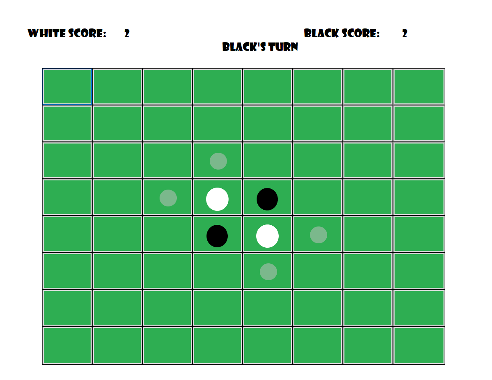

# Othello-AI-Player

## Table of Contents
- [Introduction](#introduction)
- [Game Rules](#game-rules)
- [Project Features](#project-features)
- [User Manual](#user-manual)

## Introduction
This is a project for the course of Artificial Intelligence at Ain Shams University. The goal of the project is to implement an AI player for the game of Othello. The player is implemented using different game searching algorithms like Minimax algorithm and its variant including Alpha-Beta pruning, and using a combination of heuristics based on a [paper](https://courses.cs.washington.edu/courses/cse573/04au/Project/mini1/RUSSIA/Final_Paper.pdf) from University of Washington.

## Game Rules
Othello is a strategy board game for two players, played on an 8×8 uncheckered board. There are sixty-four identical game pieces called disks, which are light on one side and dark on the other. Players take turns placing disks on the board with their assigned color facing up. During a play, any disks of the opponent's color that are in a straight line and bounded by the disk just placed and another disk of the current player's color are turned over to the current player's color. The objective of the game is to have the majority of disks turned to display your color when the last playable empty square is filled.

## Project Features
### Modes
The game supports 3 different modes of playing:
1.	Human versus Human
2.	Human versus AI
3.	AI versus AI

### Difficulty levels
The game supports 5 different difficulties the player can choose for any AI

### User Interface Features
The user interface supports multiple features:
1.	Displaying of all possible valid moves
2.	Displaying of the score of both players throughout the game
3.	Announcing the winner when no valid moves are left

## User Manual
The game is played using the mouse. Once you open the game, you will be presented with this screen:

You have 3 buttons at the top to choose the game mode. You can play against another human, against the AI, or make two AI players play against each other.

If you choose human vs human, you don't need to choose any options.

If you choose human vs AI, you will be presented with this screen:

You can choose the difficulty of the AI player. The difficulty reflects better heuristics and deeper search depth.

If you choose AI vs AI, you will be presented with this screen:

You can choose the difficulty of both AI players. The difficulty reflects better heuristics and deeper search depth.

Once you choose the game mode and the difficulty, you will be presented with the game screen:

The game screen consists of the board, the score of both players, and the possible valid moves for the current player. The valid moves are displayed as dimmed grey circles. The score is displayed as the number of disks of each player. The current player is displayed as a text in the top middle.

If you chose AI vs AI, the screen will have an additional "Next Move" button. You can click this button to make the AI player play its next move.

Once the game is over, you will be presented with this screen:

The screen will display the winner and the final score of both players.
